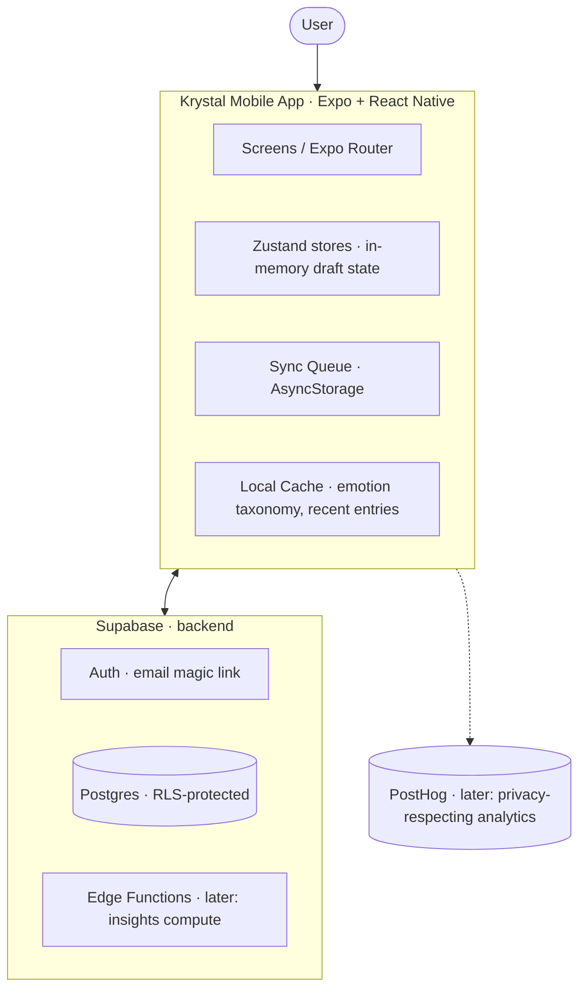
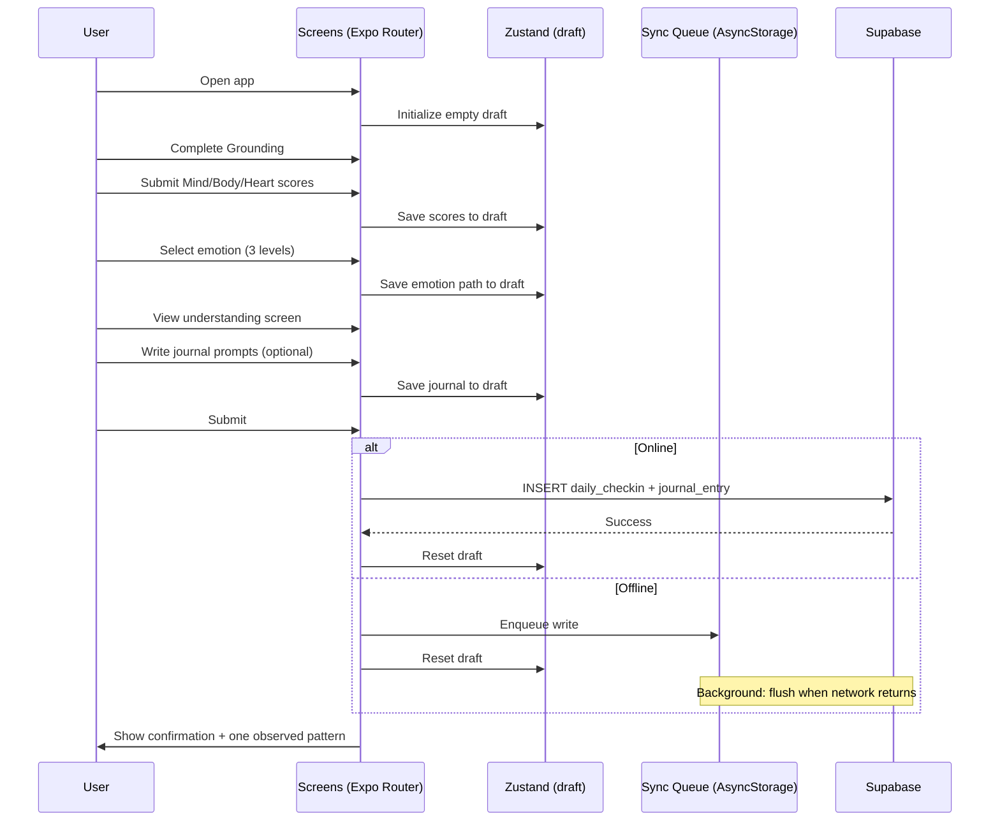
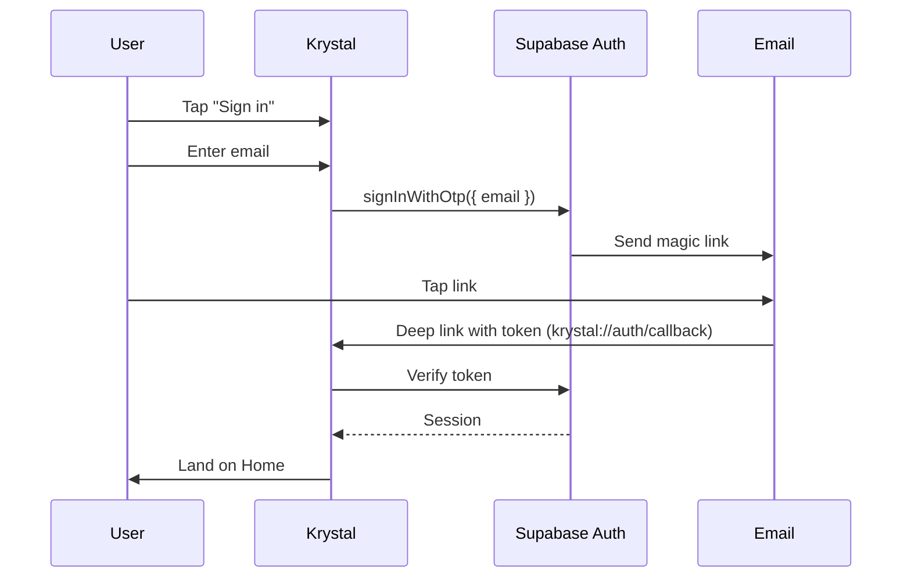

# Krystal — Architecture

**Status:** Living doc · v1.0 · 2026-06-02

---

## 1. System overview



The app is a single-target React Native client that talks directly to Supabase. No custom backend in v1 — Supabase's auth, Postgres, and RLS are sufficient.

## 2. Tech stack

| Layer | Choice | Version (as of 2026-06-02) |
| --- | --- | --- |
| Framework | Expo (managed workflow) | SDK 54 |
| Language | TypeScript (strict) | 5.3.x |
| UI | React Native + Expo Router | RN 0.85, expo-router 6.x |
| Styling | NativeWind (Tailwind for RN) | 4.x |
| State (client) | Zustand | 5.x |
| Local persistence | AsyncStorage (queue + cache) | 2.x |
| Backend | Supabase | hosted |
| Database | Postgres (Supabase-managed) | 15.x |
| Auth | Supabase Auth · email magic link | — |
| Analytics | PostHog (deferred to later phase) | — |
| Build / Distribution | EAS Build → TestFlight | — |

Versions are pinned in `package.json`; align with `npx expo install --fix` whenever bumping the Expo SDK.

## 3. Folder structure

```
krystal/
├── app/                          # Expo Router — file-based routes
│   ├── _layout.tsx               # Root: providers, theme, status bar, init
│   ├── index.tsx                 # Home (CTA to start reflection)
│   ├── (auth)/
│   │   ├── _layout.tsx           # Unauthenticated stack
│   │   └── sign-in.tsx           # Email magic-link form
│   ├── (flow)/                   # Daily reflection — protected stack
│   │   ├── _layout.tsx
│   │   ├── grounding.tsx
│   │   ├── check-in.tsx
│   │   ├── emotion/
│   │   │   ├── primary.tsx
│   │   │   ├── secondary.tsx
│   │   │   └── specific.tsx
│   │   ├── reflect.tsx           # merged Understanding + Journaling (PRD §4 Step 4)
│   │   └── done.tsx
│   ├── insights.tsx
│   └── settings.tsx
├── components/                   # Reusable, route-agnostic UI
│   ├── primitives/               # Button, Text, Slider, Card
│   ├── flow/                     # BreathCircle, EmotionTile, ScoreSlider
│   └── insights/                 # InsightCard, PatternList
├── lib/
│   ├── supabase.ts               # Supabase client (configured)
│   ├── auth.ts                   # Sign in / out / current user
│   ├── sync.ts                   # Offline queue + flush logic
│   ├── insights.ts               # Rule-based insight engine
│   └── design.ts                 # Color tokens, motion tokens, copy tone helpers
├── store/
│   ├── useReflectionStore.ts     # Active draft (resets on submit)
│   ├── useAuthStore.ts           # Session + profile
│   └── useSyncStore.ts           # Pending writes, last-sync timestamp
├── docs/                         # PRD, this file, ROADMAP, DECISIONS
├── supabase/
│   ├── migrations/               # Numbered SQL files
│   ├── seed/
│   │   └── emotions.ts           # Hybrid Plutchik + Atlas seed
│   └── policies/                 # RLS policy definitions (for reference)
└── (config files at root)
```

The `(auth)` and `(flow)` parentheses are Expo Router "groups" — they organize routes without adding to the URL path.

## 4. Data flow: one daily reflection

The user's primary path, end to end:



### Why draft state lives in Zustand, not Supabase

The reflection is in-progress for ~3 minutes. Writing intermediate steps to Supabase would:

- Create incomplete rows we'd have to clean up
- Add round-trip latency on every step
- Break the calm, paced feel

The single `INSERT` on submit (or enqueue) is the atomic unit.

## 5. Navigation map

```
/                       Home
/sign-in                (auth) Magic link entry
/(flow)/grounding       Step 1
/(flow)/check-in        Step 2
/(flow)/emotion/primary Step 3a
/(flow)/emotion/secondary Step 3b
/(flow)/emotion/specific  Step 3c
/(flow)/reflect           Step 4 (understanding + journaling, merged)
/(flow)/done              Step 5 (confirmation)
/insights               Pattern observations
/settings               Sign out, delete data, privacy info
```

The `(flow)` group is protected: redirect to `/sign-in` if no session. Implemented in `app/(flow)/_layout.tsx`.

## 6. State management strategy

Three Zustand stores. Each has a single responsibility.

- **`useReflectionStore`** — Active draft of the in-progress reflection. Resets on submit or app cold-start. Never persisted.
- **`useAuthStore`** — Current Supabase session and user profile. Hydrated from AsyncStorage on launch via Supabase client.
- **`useSyncStore`** — Pending offline writes + last successful sync timestamp. Persisted to AsyncStorage.

No global Redux. No Context-based state. Server data is fetched per-screen with simple async functions; if we later need caching we'll add TanStack Query, but v1 doesn't need it.

## 7. Sync strategy — offline-first

The user must be able to complete a full reflection without internet. Architecture:

1. On submit, attempt `supabase.from('daily_checkins').insert(...)` immediately.
2. On network failure, write the payload to a queue in AsyncStorage (`useSyncStore`).
3. A `NetInfo` listener detects when connectivity returns; on reconnect, flush the queue.
4. Each queued payload includes a client-generated UUID so retries are idempotent (server uses `INSERT … ON CONFLICT DO NOTHING`).

The emotion taxonomy is **read-only** and **fully cached** locally on first launch (~50KB). All taxonomy reads after first launch hit the cache, not Supabase. Updates flow via app updates, not live fetches.

Insights computation needs internet in v1 (queries Supabase for the user's history, runs rules locally on result). Cached after computation for the session.

## 8. Authentication flow — email magic link



- Custom URL scheme `krystal://` is already configured in `app.json`.
- Session persists via Supabase's built-in AsyncStorage adapter.
- Sign-out clears session + zeroes all Zustand stores.

## 9. Privacy & security

- **Auth-required for all user data.** No app routes other than `/sign-in` work without a session.
- **Row Level Security on every table holding user data.** Policy: `auth.uid() = user_id`. Verified per table in `/supabase/policies/`.
- **At-rest encryption** is Supabase's default (AES-256 on disk).
- **No service-role key shipped in the app.** Only the anon key is in `.env`; service-role stays server-side only (we don't have a custom server in v1, so it stays in your Supabase dashboard).
- **Settings → Delete all data** runs a transactional DELETE on the user's rows + a Supabase Auth user delete.
- **No third-party data sharing.** PostHog (when wired up) gets anonymous event counts only — never journal text, never specific emotions.

## 10. Emotion data model

Designed to merge multiple emotional frameworks under one schema, per the spec.

```sql
-- Hierarchy (Plutchik-based for v1)
emotion_categories (id, name, color, sort_order)            -- 8 primaries
emotion_subcategories (id, category_id, name, sort_order)   -- secondaries
emotion_details (
  id,
  subcategory_id,
  name,                       -- "Overwhelmed"
  framework,                  -- "plutchik" | "atlas" | "geneva" | ...
  similar_words,              -- text[]
  sensations,                 -- text[]
  what_it_tells_you,          -- text (possibility-framed)
  how_it_helps_you,           -- text (possibility-framed)
  description                 -- text (optional longer prose)
)
```

The `framework` column lets us merge multiple wheels later without schema changes. v1 seeds Plutchik hierarchy + Atlas descriptive content under the same rows. Future: a second framework lives as additional rows referencing the same hierarchy.

## 11. Insights engine (v1)

A pure-TypeScript rule pipeline in `lib/insights.ts`. Each rule is a function:

```ts
type InsightRule = (entries: DailyCheckin[]) => Insight | null;

const rules: InsightRule[] = [
  weekdayHeartScoreRule,
  emotionAfterLowBodyRule,
  consecutiveDaysJoyRule,
  // …5–8 total for v1
];
```

The screen calls each rule with the user's last 30 days of entries, collects non-null results, and renders them as cards. No insight is shown if the dataset is too small (<5 entries).

Adding a new rule = adding one function. No reactive engine, no ML. We'll re-evaluate the architecture if we ever ship dynamic patterns.

## 12. Design tokens (starter)

> **Direction:** kid-like cartoon-game aesthetic, dialed soft — see PRD §3. Warmer, slightly playful, hand-drawn feeling. The starter palette below is intentionally minimal; Phase 5 will likely warm it up and add illustrative elements (including the purple grape companion).

Defined in `tailwind.config.js`; refine as design crystallizes.

```
cream   #FAF7F2   default background
ink     #1F1F23   primary text
muted   #6B6F76   secondary text / helper copy
accent  #7B8FA1   CTA color (subdued blue-gray — likely to change)
```

Per-emotion palette (used only as supportive context, never as the dominant page color):

```
joy           #E8C547   gold
sadness       #5B7CC4   blue
anger         #C45B5B   red
fear          #8E6FB5   purple
trust         #6FAE8E   green
disgust       #A48069   brown
surprise      #6FB5AE   cyan
anticipation  #D9985A   warm orange
```

Typography: still TBD — placeholder is system serif + system sans. Phase 5 will pick a real type pairing.

Motion: prefer 200–400ms durations, ease-in-out. Avoid bounces, spring overshoot, parallax.

## 13. Build & ship pipeline

- **Development:** `npx expo start --tunnel` for Expo Go on physical device.
- **Production builds:** EAS Build (`eas build --platform ios`) once the Apple Developer account is set up.
- **Distribution:** TestFlight for friends/family, then App Store.
- **Updates:** Expo OTA for JS-only changes (no native code in managed workflow yet).

## 14. Things we are deliberately NOT building (architecturally)

- No global event bus / pub-sub
- No GraphQL layer (Supabase REST + RPC is enough)
- No microservices (one Supabase project, one app)
- No custom backend (no Node/Bun/Go server)
- No real-time subscriptions (no `supabase.channel`) — Krystal isn't collaborative
- No ML pipeline
- No custom auth (Supabase's is fine)

Resist the urge. Add any of these only when there's a real user need we can't solve otherwise.
